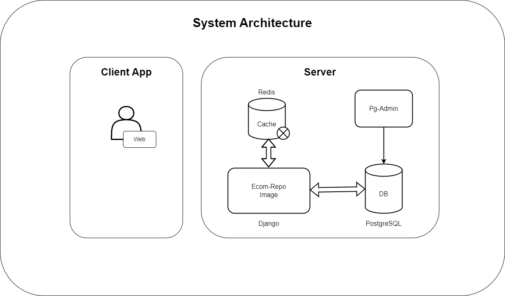

## Ecommerce-Business-Platform

### Description
A user-friendly and feature-rich e-commerce platform that will provide our customers with the best possible shopping experience.

### System Architecture

<!-- ### Database Schema -->

### Features
- [x] User Authentication
- [x] User Authorization
- [x] User Profile
- [x] Product Management
- [x] Shopping Cart
- [x] Order Management
- [x] Payments Management
- [x] Shipping
- [x] Search
- [x] Rating and Review
- [ ] Analytics
- [ ] Reporting
- [ ] Customer Support
- [x] Admin Dashboard
- [ ] Seller Dashboard
- [ ] Delivery Dashboard

### Tech Stack
- [x] Nuxt.js
- [x] Django
- [x] Django REST Framework
- [x] PostgreSQL
